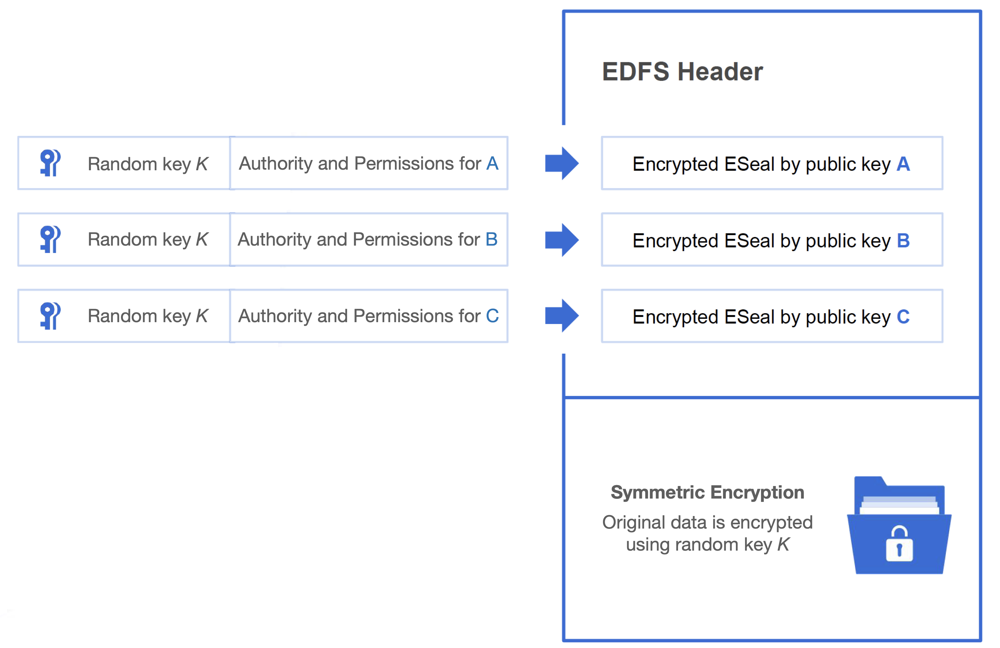
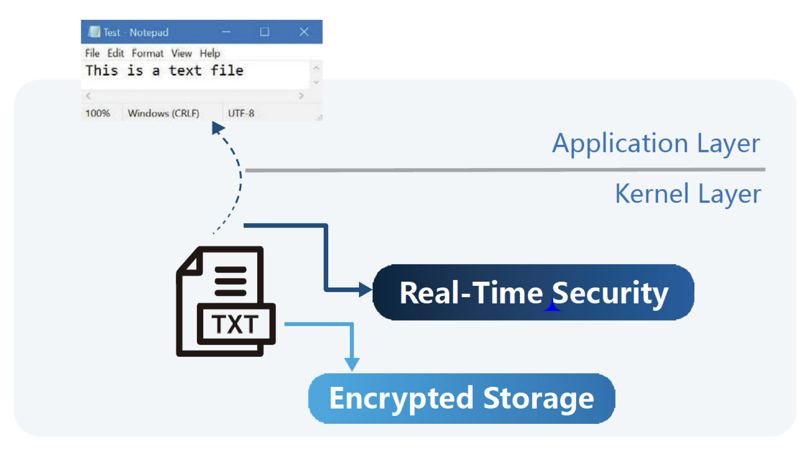

# Decentralized File Security

### ESeal

**The encryption structure of files is the core building block for enforcing security on files. Each file which is uploaded to Nela follows the following scheme:**

**Body -** The actual file is encrypted through symmetric encryption and a random key.

**Header -** The encrypted file contains with it a header, in which each identity's permissions as well as the body's random key are encrypted together using asymmetric encryption.

<figure><figcaption>
EDFS file encryption protocol
</figcaption></figure>

Authority and permissions can be to the degree of what can be done with the file (view, edit, create a duplicate, etc.) to what Operating System is accepted or if a hardware device is required. Through this encryption scheme, permissions on files can be given by only having knowledge of a user's public key, setting the foundation of trust-less access control management within Nela's encrypted decentralized file system.

### Real-Time Encryption/Decryption

Nela's approach to file security boils down to the file level rather than the obfuscation of content behind paywalls and download access barriers. This allows for Nela to enforce the highest degree of control for file owners.

**Files stay encrypted throughout their entire life-cycle.** That is, files are encrypted before they are uploaded to the network, through their delivery, during their use, and up until their destruction. The only identity able to turn the encrypted file back into its unencrypted form is the current permissioned owner of the encrypted file.

**Just because a file is encrypted, does not mean it cannot be used.** Nela's SDK provides an all encompassing range of tools for client-side real-time encryption and decryption of these encrypted files and are a product of global industry experts in domains such as operating systems and file security.

Even as a downloaded file on an end user's terminal, files must assert that a user is permissioned through a private key corresponding to an ESeal entry of the encrypted file's header. This process happens automatically and seamlessly from the end user's perspective. If permissioned, a file is decrypted in real-time directly to the application using it. Furthermore, for each operation in which the application interacts with the file (reading, copying, modifying, etc.), the user's permissions are asserted before decryption/encryption occurs. If it is the case the the operation is not valid, the software will redirect the process to maintain the integrity of the asset.

The real-time encryption and decryption software allows users to unlock their corresponding ESeals in order to access the file's random key. This, however, is done in a way that prevents the user from ever accessing the random key itself.

How can file owners retroactively revoke access to a downloaded file? Nela also allows for what is called a _dynamic header._ Instead of downloading the full header of an encrypted file, user's download a header with a simple pointer to the network. It is at this location in the network where the full header of the encrypted file is located. Through this, every time a user uses the encrypted file on his terminal, a check is made with the network to authenticate that the user is still permissioned to access the file. If permissions are revoked retroactively, the user will not be able to use the file even if the file is already downloaded on his end terminal.

### Security Modules

Nela's basic SDK allows for interaction with the network directly via HTTP from any terminal. Files can be uploaded to the network, located within the network and downloaded directly. Calling smart contracts from any device allows DApps and users to manage monetization, access control and permissions on files trust-lessly.

Nela's SDK includes a suite of modules allowing developers to pick and choose what functionality of Nela to integrate for their specific use case and platform. Whether integration to a website is required, a simple WebApp or compatibility with the file's native applications.

#### DSFS & Security Sandbox

The Decentralized Secure File System and Security Sandbox are components which sit on the kernel layer of the operating system. With this architecture, real-time encryption and decryption as well as identity and permission assertion is compatible with any native application that can open the file. (e.g. an encrypted ps file can be opened directly through Photoshop).&#x20;

<figure><figcaption>
Kernel layer encryption/decryption.
</figcaption></figure>

Every time a user attempt to interact with an encrypted file, identity is verified either with the locally stored file header or dynamic header on Nela's decentralized storage. There are a limited number of operations that applications can call on the file system (read, write, copy, etc.), for every operation, the DSFS and Security Sandbox work in conjunction to redirect any of the disallowed operations to the encrypted version of the file, in order to enforce the permissions set by the owner even on the end user's terminal. The Security Sandbox works alongside the kernel and application layer to provide complete IP security for files.

Because these modules work on the kernel layer of the operating system there is no need to abide by the different standards of each application and file type, in fact, it is infeasible to create compatibility with all existing native applications and file types otherwise. Through this structure we can ensure compatibility with all existing native applications and file types as well as the ones that will come in the future.

#### Local Service

The Local Service module provides Nela's functionality within a standard WebApp. Interacting directly with the network, the Local Service can utilize any encrypted media that can be played through your standard web development stack (image, music, video, etc.).

At its core, Local Service is a general HTTP server that captures any URL of the form \[EDFS://\*]. there is no difference between using EDFS decentralized storage and HTTP from the user's perspective.

In addition, the module enables the encryption/decryption and access level control functionality to greatly simplify HTML-CSS-JS development of DApps.

### The Nela Wallet

Accessibility and simplicity of use is a core component for adoptability. Nela will release a wallet application which will also incorporate all of the security modules as built in. By doing so, development can cater towards the largest developer demographic in the world, the Web developers.

The Nela wallet application will act as a standard wallet application to interact with any website or application in its ecosystem but will also allow for the full functionality of file security within the standard web clients (Google Chrome, Opera, etc.) and also within the actual end-user computer (downloaded files within their native applications).

Additionally, a JavaScript SDK will be provided. As a developer, deploying a Nela compatible DApp is as easy as writing a standard website. As a user, harnessing all of Nela's functionality and accessing its DApp ecosystem is as easy as downloading the native wallet application.
